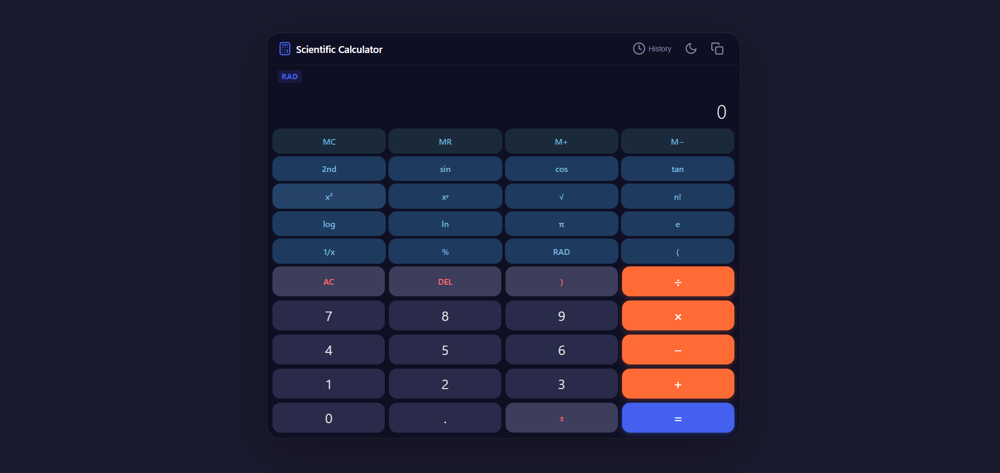
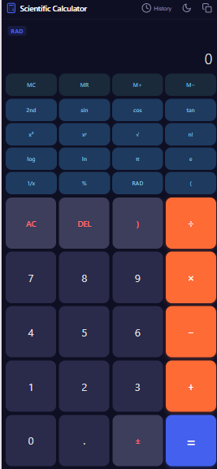

# 🧮 Scientific Calculator Web Application

[🚀 Live Demo Link](https://your-username.github.io/scientific-calculator/) | [📁 GitHub Repository](https://github.com/your-username/scientific-calculator)

A responsive, feature-rich, and accessible scientific calculator web application built with pure Vanilla HTML5, CSS3, and JavaScript (ES6+). 

This project was developed strictly avoiding `eval()`, `new Function()`, or external mathematical libraries, featuring a custom-built mathematical evaluator powered by Dijkstra's **Shunting-Yard Algorithm**.

---

## 📸 Screenshots

| Desktop View | Mobile View |
| :---: | :---: |
|  |  |

*(Note: Create a `screenshots/` folder in your project, add `desktop.png` and `mobile.png`, or update the paths above to match your image filenames.)*

---

## ✨ Features

### 1. Basic Operations
- **Standard Arithmetic**: Addition ($+$), Subtraction ($-$ / $\text{−}$), Multiplication ($\times$), and Division ($\div$).
- **Precision Control**: Fixes IEEE 754 floating-point inaccuracies (e.g., `0.1 + 0.2` correctly yields `0.3`).
- **Input Validation**: Prevents invalid input like multiple decimal points per number or consecutive operators.
- **Controls**: Clear All (`AC`), Character Delete (`DEL`), and Sign Toggle ($\pm$).

### 2. Advanced Operations
- **Trigonometry**: `sin`, `cos`, `tan` with dynamic **DEG** (Degrees) and **RAD** (Radians) mode toggling.
- **Inverse Trigonometry**: `sin⁻¹`, `cos⁻¹`, `tan⁻¹` accessible via the **2nd / Shift** toggle button.
- **Powers & Roots**: Square ($x^2$), Custom Power ($x^y$), Square Root ($\sqrt{x}$), and Reciprocal ($1/x$).
- **Logarithms**: Common Logarithm ($\log_{10}$) and Natural Logarithm ($\ln$).
- **Constants**: Direct insertion of $\pi$ ($3.14159\dots$) and Euler's number $e$ ($2.71828\dots$).
- **Factorial & Percentages**: Non-negative integer factorials ($n!$) and percentage calculations ($\%$).
- **Parentheses**: Grouping expressions with parenthesis balance checking.

### 3. Memory Functions
- **MC**: Clears stored memory value.
- **MR**: Inserts the stored value into the current expression.
- **M+**: Adds the current result/input to stored memory.
- **M−**: Subtracts the current result/input from stored memory.
- **Visual Indicator**: Displays an `M` badge on the screen whenever memory holds a non-zero value.

### 4. History Panel & Local Storage
- Keeps a list of the **last 10 calculations** (expression and result).
- Slide-out side panel with overlay support on mobile screens.
- **Click to Recall**: Clicking any history entry loads its result back into the display.
- **Persistence**: Calculation history, active theme, and memory value persist across page refreshes using `localStorage`.

### 5. UI/UX & Keyboard Support
- **Responsive Layout**: Designed with CSS Grid and Flexbox for mobile (360px) up to desktop resolutions.
- **Theming**: Light and Dark theme toggle using CSS custom properties (`:root` variables).
- **Visual Feedback**: On-screen buttons show active press effects when triggered via mouse or keyboard.
- **Clipboard API**: Copy results to clipboard with an animated toast notification.

---

## 🛠️ How the Evaluator Works

To comply with strict security guidelines forbidding `eval()`, expression parsing is executed via a custom pipeline inside `js/evaluator.js`:
Input Expression String
↓
[1. Tokenizer] ➔ Splits string into numbers, operators, functions & parens
↓
[2. Implicit Multiplier] ➔ Inserts implicit '×' (e.g., "2π" ➔ "2 × π", "3(4)" ➔ "3 × (4)")
↓
[3. Shunting-Yard Parser] ➔ Transforms Infix tokens to Reverse Polish Notation (RPN)
↓
[4. RPN Stack Evaluator] ➔ Evaluates Postfix queue using a LIFO Stack
↓
Formatted Numerical Result

### Key Rules Handled:
1. **Operator Precedence**:
   - **Precedence 5**: Factorials ($!$)
   - **Precedence 4**: Percentages ($\%$)
   - **Precedence 3**: Exponentiation ($^$) — *Right-Associative* ($2^3^2 = 2^{(3^2)} = 512$)
   - **Precedence 2**: Multiplication ($\times$) and Division ($\div$) — *Left-Associative*
   - **Precedence 1**: Addition ($+$) and Subtraction ($-$) — *Left-Associative*
2. **Error Handling**: Detects domain errors (division by zero, negative square roots, negative factorials) and displays clear messages without crashing.
3. **Precision**: Uses `parseFloat(Number(result).toPrecision(12))` to remove floating-point noise.

---

## ⌨️ Keyboard Shortcuts Map

| Physical Key | Calculator Action |
| :--- | :--- |
| `0` – `9` and `.` | Digits and decimal point |
| `+`, `-`, `*`, `/` | Basic operators ($+$, $-$, $\times$, $\div$) |
| `^` | Power ($x^y$) |
| `%` | Percentage ($\%$) |
| `!` | Factorial ($n!$) |
| `(` and `)` | Open and close parentheses |
| `Enter` or `=` | Calculate / Evaluate expression |
| `Backspace` | Delete last character (`DEL`) |
| `Escape` | Clear all (`AC`) |

---

## 🧪 Test Case Matrix

| # | Input | Angle Mode | Expected Result | Status |
| :-: | :--- | :---: | :--- | :-: |
| **1** | `12 + 7 × 2` | DEG | `26` | ✅ Pass |
| **2** | `(12 + 7) × 2` | DEG | `38` | ✅ Pass |
| **3** | `0.1 + 0.2` | DEG | `0.3` | ✅ Pass |
| **4** | `10 ÷ 0` | DEG | `Cannot divide by zero` | ✅ Pass |
| **5** | `2 ^ 3 ^ 2` | DEG | `512` | ✅ Pass |
| **6** | `√(144) + 3²` | DEG | `21` | ✅ Pass |
| **7** | `5!` | DEG | `120` | ✅ Pass |
| **8** | `(−3)!` | DEG | `Error` | ✅ Pass |
| **9** | `sin(30)` | DEG | `0.5` | ✅ Pass |
| **10** | `cos(π)` | RAD | `-1` | ✅ Pass |
| **11** | `log(1000) + ln(e)` | DEG | `4` | ✅ Pass |
| **12** | `√(−9)` | DEG | `Error` | ✅ Pass |
| **13** | `200 × 10 %` | DEG | `20` | ✅ Pass |
| **14** | `5 M+`, `3 M+`, `MR` | DEG | `8` | ✅ Pass |
| **15** | Pressing `+` twice | DEG | Replaces first operator | ✅ Pass |
| **16** | `(2 + 3` | DEG | Evaluates to `5` | ✅ Pass |

---

## 📁 Project Structure
scientific-calculator/
├── index.html # Semantic HTML5 markup
├── style.css # CSS Grid, Flexbox, variables & animations
├── js/
│ ├── evaluator.js # Custom Shunting-Yard math engine (No eval)
│ └── app.js # UI State management, event delegation & DOM controller
├── screenshots/ # Desktop and mobile screenshots
└── README.md # Project documentation